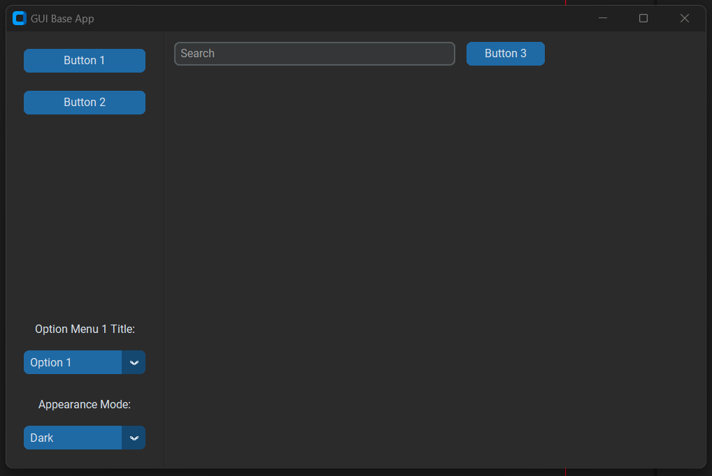

# GUI_base
 Base GUI for a desktop app using customtkinter. This will serve as a base 
 application that one can add other functionality to quickly.




## File architecture:
```
|- GUI_base/
|--|- img/                                  | Image files or screenshots.
|--|- modules/                              | All custom code to be imported in app.py
|--|--|- buttons/                           | All of the button events code.
|--|--|--|- button1.py                      | Code for on click event for button 1.
|--|--|--|- button2.py                      | Code for on click event for button 2.
|--|--|- dropdown_menus/                    | All of the dropdown menu code.
|--|--|--|- change_appearance_mode.py       | Code for changing the light/dark mode.
|--|--|--|- change_options_menu1.py         | Code for the options menu.
|--|- app.py                                | Defines the application.
```